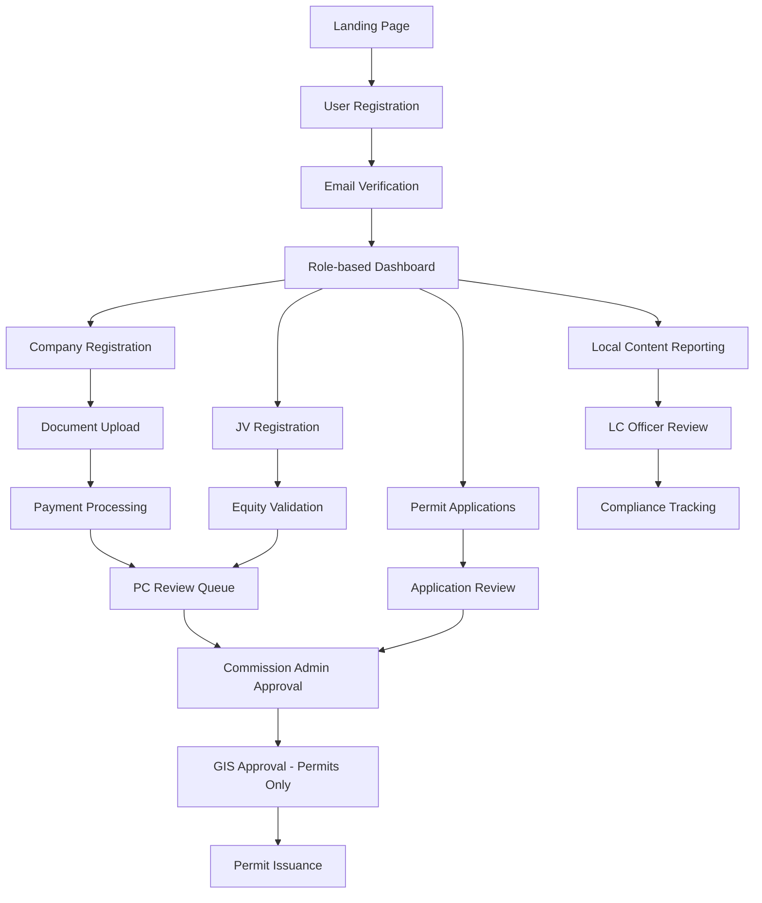

# Product Requirements Document (PRD)
## Petroleum Commission Offshore Tracking System (PC-OTS)

## 1. Product Overview

The Petroleum Commission Offshore Tracking System (PC-OTS) is a comprehensive full-stack web application designed to digitize and streamline all regulatory, compliance, and permit management workflows for Ghana's upstream petroleum sector. The system serves companies, personnel, joint venture partners, and Petroleum Commission staff by eliminating incomplete applications through digital validation, automating approval workflows, and providing real-time tracking and analytics.

The platform addresses critical challenges in petroleum sector regulation by enforcing compliance requirements, reducing processing times, and ensuring complete audit trails for all regulatory activities. It targets petroleum companies, government regulatory bodies, and industry personnel operating in Ghana's upstream petroleum sector.

## 2. Core Features

### 2.1 User Roles

| Role | Registration Method | Core Permissions |
|------|---------------------|------------------|
| ADMIN | System administrator assignment | Full system access, user management, system configuration |
| COMMISSION_ADMIN | PC staff assignment | Final approvals, workflow oversight, analytics access |
| COMPLIANCE_OFFICER | PC staff assignment | Regulatory compliance review, audit access |
| INSPECTOR | PC staff assignment | Field inspection management, compliance verification |
| IMMIGRATION_OFFICER | GIS staff assignment | Personnel permit review and approval |
| JV_COORDINATOR | PC staff assignment | Joint venture oversight and coordination |
| FINANCE_OFFICER | PC staff assignment | Payment verification, fee management |
| COMPANY_ADMIN | Company registration and verification | Company-level administration, application management |
| PERSONNEL | Company invitation or self-registration | Personal permit applications, document management |

### 2.2 Feature Module

Our PC-OTS requirements consist of the following main pages:

1. **Landing Page**: Hero section with Ghana flag/PC logo, mission statement, quick statistics, main navigation menu, regulatory documents access, and public information search.

2. **Authentication Pages**: User registration with role-based access, email verification, secure login with JWT tokens, password reset functionality.

3. **Company Registration**: Multi-step registration form covering corporate structure, financial capability, technical competency, local content commitments, HSSE policies, and document uploads.

4. **Dashboard Pages**: Role-specific dashboards with application status tracking, workflow queues, analytics charts, notification centers, and quick action panels.

5. **Permit Application Pages**: Regular and Rotator permit applications with comprehensive forms, document upload requirements, payment processing, and status tracking.

6. **Personnel Management**: Staff registration for local and expatriate personnel, document management, permit tracking, and compliance monitoring.

7. **Joint Venture Management**: JV company registration, equity validation, board resolution uploads, and compliance tracking.

8. **Local Content Reporting**: Annual plan submissions, performance reporting, compliance tracking, and evidence uploads.

9. **Payment Processing**: Fee calculation, payment gateway integration, receipt uploads, transaction tracking, and financial reporting.

10. **Document Management**: Secure file uploads, version control, expiry tracking, and compliance document storage.

11. **Audit and Compliance**: Complete audit trails, compliance monitoring, inspection scheduling, and regulatory reporting.

12. **Analytics and Reporting**: Real-time dashboards, compliance metrics, financial reporting, and industry analytics.

### 2.3 Page Details

| Page Name | Module Name | Feature Description |
|-----------|-------------|---------------------|
| Landing Page | Hero Section | Display Ghana flag/PC logo, mission statement, key statistics (total companies, permits issued, Ghanaian ownership %), navigation menu |
| Landing Page | Public Information | Quick search functionality, regulatory documents access, FAQ section, contact information |
| Authentication | User Registration | Multi-step registration with email verification, role assignment, password security requirements |
| Authentication | Login System | Secure JWT-based authentication, role-based redirects, session management, password reset |
| Company Registration | Corporate Structure | Company details form, incorporation information, contact details, subsidiary/affiliate information |
| Company Registration | Ownership Details | Shareholder information, equity percentages, director listings, management team details |
| Company Registration | Financial Capability | Audited reports upload, funding sources, financial projections, budget planning |
| Company Registration | Technical Competency | Staff expertise details, equipment sources, organizational charts, experience documentation |
| Company Registration | Local Content | Ghanaian participation percentages, employment plans, infrastructure investments, service values |
| Company Registration | HSSE Compliance | Health, Safety, Security, Environment policy uploads, objectives documentation |
| Company Registration | Document Management | Checklist-based uploads, file validation, version control, expiry tracking |
| Dashboard | Company Admin | Application overview cards, permit status, payment tracking, personnel management, notifications |
| Dashboard | PC Staff | Review queues by type, pending applications, workflow tracker, audit logs, analytics |
| Dashboard | Commission Admin | Approval queues, application tracker, workflow status viewer, payment confirmation, escalations |
| Dashboard | GIS Officer | Permit review queue, issued permits, application timeline, approval actions |
| Dashboard | Personnel | Personal permit status, document uploads, application history, renewal reminders |
| Permit Applications | Regular Permits | Comprehensive application form, document uploads (passport, medical, BOSIET, police), employment details |
| Permit Applications | Rotator Permits | Rotator-specific application form, status tracking, document management, approval workflow |
| Permit Applications | Application Tracking | Real-time status updates, workflow timeline, comment history, approval chain visibility |
| Personnel Management | Staff Registration | Local and expatriate personnel registration, document uploads, permit tracking |
| Personnel Management | Document Tracking | Certificate expiry monitoring, renewal notifications, compliance status, version control |
| JV Management | JV Registration | Joint venture company details, equity validation (100% total), board resolutions, agreements |
| JV Management | Compliance Tracking | Ghanaian equity monitoring, contract tracking, compliance flags, reporting |
| Local Content | Plan Submission | Annual LC plans, employment targets, training programs, community investments |
| Local Content | Performance Reporting | Quarterly reports, achievement tracking, compliance assessment, evidence uploads |
| Payment Processing | Fee Calculation | Automatic fee determination, service-based pricing, tax calculations, payment schedules |
| Payment Processing | Payment Gateway | InterPayAfrica API integration, multiple payment methods, receipt generation, transaction verification |
| Payment Processing | Transaction Management | Payment status tracking, receipt uploads, verification workflows, financial reporting |
| Document Management | File Upload System | Secure uploads, virus scanning, format validation, metadata capture, access control |
| Document Management | Version Control | Document versioning, expiry tracking, renewal notifications, audit trails |
| Audit System | Activity Logging | Complete audit trails, user action tracking, timestamp logging, immutable records |
| Audit System | Compliance Monitoring | Regulatory compliance tracking, violation alerts, corrective action management |
| Analytics | Dashboard Charts | Real-time metrics, application status distribution, permit expiry timelines, compliance rates |
| Analytics | Reporting System | Financial reports, compliance analytics, industry benchmarking, trend analysis |
| Notification System | Multi-channel Alerts | In-app notifications, email alerts, SMS notifications, dashboard badges |
| Notification System | Alert Management | Read/unread tracking, notification history, user preferences, delivery confirmation |

## 3. Core Process

### Company Registration Flow
Companies begin by creating an account and verifying their email address. They then complete a comprehensive multi-step registration form covering corporate structure, financial capability, technical competency, and local content commitments. After uploading required documents and paying registration fees, the application enters the PC review workflow where it progresses through various approval stages before final approval or rejection.

### Permit Application Flow (Regular/Rotator)
Registered companies or personnel submit permit applications with required documentation and payment. Applications are reviewed by PC staff, then forwarded to the Commission Admin for approval. For Regular and Rotator permits, approved applications are forwarded to Ghana Immigration Service (GIS) for final approval and permit issuance.

### Joint Venture Management Flow
Companies register JV entities with equity validation ensuring 100% total equity distribution. The system validates Ghanaian equity requirements and processes board resolutions and agreements through the approval workflow.

### Local Content Compliance Flow
Companies submit annual Local Content plans and quarterly performance reports. Local Content officers review submissions, track compliance against targets, and flag non-compliance issues for corrective action.

## 4. User Interface Design

### 4.1 Design Style
- **Primary Colors**: Ghana flag colors - Red (#CE1126), Gold (#FCD116), Green (#006B3F), with Blue (#002F6C) for PC branding
- **Secondary Colors**: Professional grays (#F8F9FA, #6C757D, #343A40) and status colors (success green, warning amber, error red)
- **Button Style**: Modern rounded buttons with subtle shadows, hover effects, and clear call-to-action styling
- **Typography**: Inter font family with 16px base size, clear hierarchy using font weights (400, 500, 600, 700)
- **Layout Style**: Card-based design with clean spacing, responsive grid system, top navigation with role-based menus
- **Icons**: Lucide React icon set for consistency, petroleum industry-specific icons for specialized functions

### 4.2 Page Design Overview

| Page Name | Module Name | UI Elements |
|-----------|-------------|-------------|
| Landing Page | Hero Section | Full-width hero with Ghana flag background, centered PC logo, mission statement overlay, statistics cards with animated counters |
| Landing Page | Navigation | Sticky top navigation with PC branding, main menu items, login/register buttons, responsive mobile menu |
| Dashboard | Overview Cards | Status cards with icons, numbers, and trend indicators using primary colors, hover effects, click actions |
| Dashboard | Charts Section | Recharts integration with responsive design, Ghana flag color scheme, interactive tooltips, export functionality |
| Company Registration | Multi-step Form | Progress indicator, step validation, save draft functionality, document upload zones with drag-and-drop |
| Company Registration | Document Upload | File upload areas with progress bars, file type validation, preview functionality, checklist completion indicators |
| Permit Applications | Application Forms | Clean form layouts with conditional fields, inline validation, required field indicators, help tooltips |
| Permit Applications | Status Tracking | Timeline component with status indicators, comment sections, approval chain visualization |
| Payment Processing | Payment Interface | Secure payment forms, receipt upload areas, transaction status indicators, payment method selection |
| Analytics | Dashboard Charts | Interactive charts with filtering, export options, responsive design, real-time data updates |

### 4.3 Responsiveness
The application follows a desktop-first approach with mobile-adaptive design. All interfaces are optimized for tablets and mobile devices with touch-friendly interactions, collapsible navigation menus, and responsive data tables. The system prioritizes usability across all device types while maintaining professional appearance for government and corporate users.

