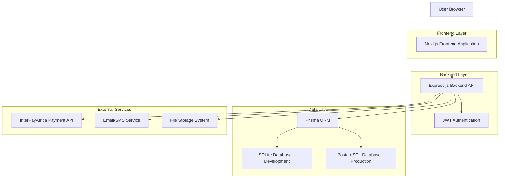
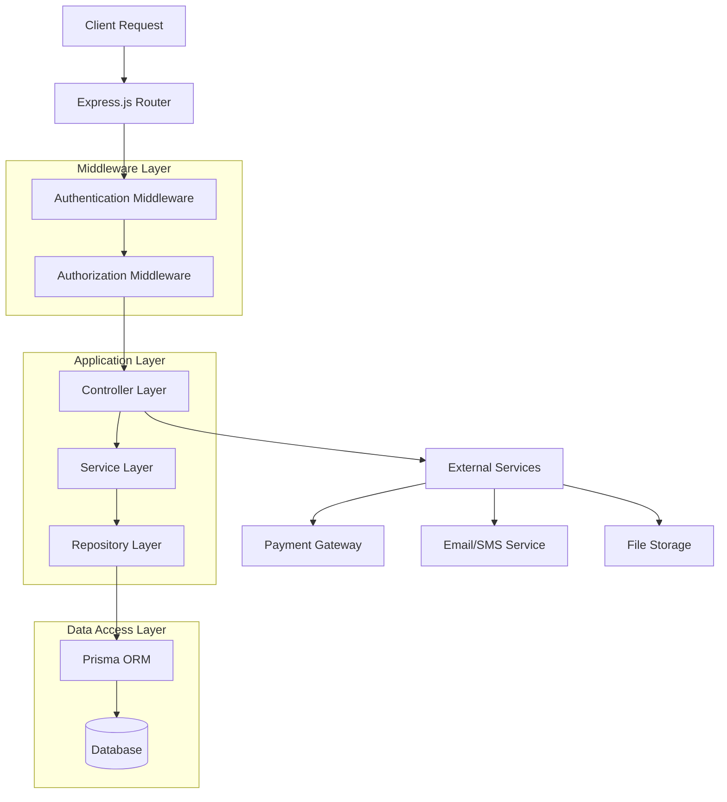
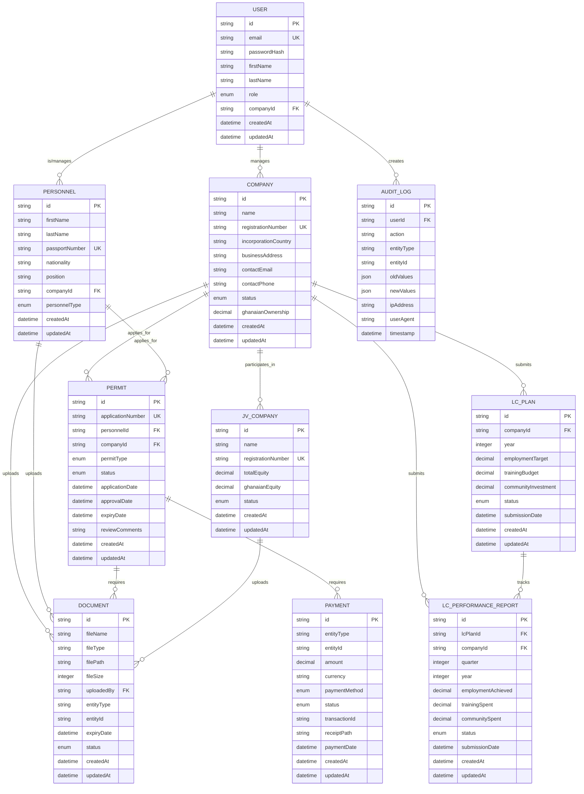

# Technical Architecture Document
## Petroleum Commission Offshore Tracking System (PC-OTS)

## 1. Architecture Design



## 2. Technology Description

- **Frontend**: Next.js@14 + TypeScript@5 + Tailwind CSS@3 + Lucide React + Recharts + Inter Font
- **Backend**: Node.js@20 + Express.js@4 + TypeScript@5
- **Database**: SQLite (development) + PostgreSQL (production) + Prisma ORM@5
- **Authentication**: JWT + bcrypt for password hashing
- **File Storage**: Local storage (development) + Cloud storage (production)
- **Payment Integration**: InterPayAfrica API
- **Deployment**: Railway (backend) + Vercel (frontend)
- **Development Tools**: Docker + Docker Compose

## 3. Route Definitions

| Route | Purpose |
|-------|----------|
| / | Landing page with public information and navigation |
| /auth/login | User authentication and role-based login |
| /auth/register | User registration with email verification |
| /auth/reset-password | Password reset functionality |
| /dashboard | Role-specific dashboard with overview and navigation |
| /company/register | Multi-step company registration process |
| /company/profile | Company profile management and updates |
| /permits/regular | Regular permit application form and management |
| /permits/rotator | Rotator permit application form and management |
| /permits/status | Permit application status tracking |
| /personnel/register | Personnel registration and management |
| /personnel/profile | Individual personnel profile and documents |
| /jv/register | Joint venture company registration |
| /jv/management | JV compliance and equity management |
| /local-content/plans | Local content plan submission and tracking |
| /local-content/reports | Performance reporting and compliance |
| /payments | Payment processing and transaction history |
| /documents | Document management and file uploads |
| /analytics | Analytics dashboard and reporting |
| /audit | Audit logs and compliance tracking |
| /notifications | Notification center and alert management |
| /admin | System administration (ADMIN role only) |

## 4. API Definitions

### 4.1 Core API

**Authentication APIs**
```
POST /api/auth/register
POST /api/auth/login
POST /api/auth/logout
POST /api/auth/refresh
POST /api/auth/reset-password
```

**Company Management APIs**
```
POST /api/companies/register
GET /api/companies/profile
PUT /api/companies/profile
GET /api/companies/applications
POST /api/companies/documents
```

**Permit Management APIs**
```
POST /api/permits/regular
POST /api/permits/rotator
GET /api/permits/status/:id
PUT /api/permits/:id/review
PUT /api/permits/:id/approve
```

**Personnel Management APIs**
```
POST /api/personnel/register
GET /api/personnel/profile
PUT /api/personnel/profile
POST /api/personnel/documents
GET /api/personnel/permits
```

**Payment Processing APIs**
```
POST /api/payments/calculate-fee
POST /api/payments/initiate
POST /api/payments/verify
GET /api/payments/history
POST /api/payments/receipt-upload
```

**Document Management APIs**
```
POST /api/documents/upload
GET /api/documents/:id
DELETE /api/documents/:id
GET /api/documents/expiring
```

### 4.2 API Request/Response Examples

**User Registration**
```
POST /api/auth/register
```

Request:
| Param Name | Param Type | isRequired | Description |
|------------|------------|------------|-------------|
| email | string | true | User email address |
| password | string | true | Password (min 8 chars) |
| firstName | string | true | User first name |
| lastName | string | true | User last name |
| role | string | true | User role (COMPANY_ADMIN, PERSONNEL, etc.) |
| companyId | string | false | Company ID (for company users) |

Response:
| Param Name | Param Type | Description |
|------------|------------|-------------|
| success | boolean | Registration status |
| message | string | Success/error message |
| userId | string | Created user ID |
| verificationToken | string | Email verification token |

Example Request:
```json
{
  "email": "admin@company.com",
  "password": "SecurePass123!",
  "firstName": "John",
  "lastName": "Doe",
  "role": "COMPANY_ADMIN"
}
```

**Permit Application Submission**
```
POST /api/permits/regular
```

Request:
| Param Name | Param Type | isRequired | Description |
|------------|------------|------------|-------------|
| personnelId | string | true | Personnel ID |
| permitType | string | true | REGULAR or ROTATOR |
| employmentDetails | object | true | Employment information |
| documents | array | true | Required document uploads |
| paymentReceiptId | string | true | Payment receipt reference |

Response:
| Param Name | Param Type | Description |
|------------|------------|-------------|
| success | boolean | Application status |
| applicationId | string | Created application ID |
| status | string | Initial status (SUBMITTED) |
| nextSteps | array | Required next actions |

## 5. Server Architecture Diagram



## 6. Data Model

### 6.1 Data Model Definition



### 6.2 Data Definition Language

**User Table**
```sql
-- Create Users table
CREATE TABLE users (
    id TEXT PRIMARY KEY DEFAULT (lower(hex(randomblob(16)))),
    email TEXT UNIQUE NOT NULL,
    password_hash TEXT NOT NULL,
    first_name TEXT NOT NULL,
    last_name TEXT NOT NULL,
    role TEXT NOT NULL CHECK (role IN ('ADMIN', 'COMMISSION_ADMIN', 'COMPLIANCE_OFFICER', 'INSPECTOR', 'IMMIGRATION_OFFICER', 'JV_COORDINATOR', 'FINANCE_OFFICER', 'COMPANY_ADMIN', 'PERSONNEL')),
    company_id TEXT,
    email_verified BOOLEAN DEFAULT FALSE,
    created_at DATETIME DEFAULT CURRENT_TIMESTAMP,
    updated_at DATETIME DEFAULT CURRENT_TIMESTAMP,
    FOREIGN KEY (company_id) REFERENCES companies(id)
);

-- Create indexes
CREATE INDEX idx_users_email ON users(email);
CREATE INDEX idx_users_role ON users(role);
CREATE INDEX idx_users_company_id ON users(company_id);
```

**Company Table**
```sql
-- Create Companies table
CREATE TABLE companies (
    id TEXT PRIMARY KEY DEFAULT (lower(hex(randomblob(16)))),
    name TEXT NOT NULL,
    registration_number TEXT UNIQUE NOT NULL,
    incorporation_country TEXT NOT NULL,
    business_address TEXT NOT NULL,
    contact_email TEXT NOT NULL,
    contact_phone TEXT NOT NULL,
    status TEXT NOT NULL DEFAULT 'PENDING' CHECK (status IN ('PENDING', 'UNDER_REVIEW', 'APPROVED', 'REJECTED', 'SUSPENDED')),
    ghanaian_ownership DECIMAL(5,2) DEFAULT 0.00,
    permit_category TEXT CHECK (permit_category IN ('SPECIALIZED', 'GENERAL')),
    created_at DATETIME DEFAULT CURRENT_TIMESTAMP,
    updated_at DATETIME DEFAULT CURRENT_TIMESTAMP
);

-- Create indexes
CREATE INDEX idx_companies_registration_number ON companies(registration_number);
CREATE INDEX idx_companies_status ON companies(status);
CREATE INDEX idx_companies_permit_category ON companies(permit_category);
```

**Personnel Table**
```sql
-- Create Personnel table
CREATE TABLE personnel (
    id TEXT PRIMARY KEY DEFAULT (lower(hex(randomblob(16)))),
    first_name TEXT NOT NULL,
    last_name TEXT NOT NULL,
    passport_number TEXT UNIQUE NOT NULL,
    nationality TEXT NOT NULL,
    position TEXT NOT NULL,
    company_id TEXT NOT NULL,
    personnel_type TEXT NOT NULL CHECK (personnel_type IN ('LOCAL', 'EXPATRIATE')),
    date_of_birth DATE,
    gender TEXT CHECK (gender IN ('MALE', 'FEMALE')),
    marital_status TEXT CHECK (marital_status IN ('SINGLE', 'MARRIED', 'DIVORCED', 'WIDOWED')),
    created_at DATETIME DEFAULT CURRENT_TIMESTAMP,
    updated_at DATETIME DEFAULT CURRENT_TIMESTAMP,
    FOREIGN KEY (company_id) REFERENCES companies(id)
);

-- Create indexes
CREATE INDEX idx_personnel_passport_number ON personnel(passport_number);
CREATE INDEX idx_personnel_company_id ON personnel(company_id);
CREATE INDEX idx_personnel_type ON personnel(personnel_type);
```

**Permit Table**
```sql
-- Create Permits table
CREATE TABLE permits (
    id TEXT PRIMARY KEY DEFAULT (lower(hex(randomblob(16)))),
    application_number TEXT UNIQUE NOT NULL,
    personnel_id TEXT NOT NULL,
    company_id TEXT NOT NULL,
    permit_type TEXT NOT NULL CHECK (permit_type IN ('REGULAR', 'ROTATOR')),
    status TEXT NOT NULL DEFAULT 'SUBMITTED' CHECK (status IN ('SUBMITTED', 'PC_REVIEW', 'PC_CEO_REVIEW', 'COMMISSION_ADMIN_REVIEW', 'GIS_REVIEW', 'APPROVED', 'REJECTED')),
    application_date DATETIME DEFAULT CURRENT_TIMESTAMP,
    approval_date DATETIME,
    expiry_date DATETIME,
    review_comments TEXT,
    created_at DATETIME DEFAULT CURRENT_TIMESTAMP,
    updated_at DATETIME DEFAULT CURRENT_TIMESTAMP,
    FOREIGN KEY (personnel_id) REFERENCES personnel(id),
    FOREIGN KEY (company_id) REFERENCES companies(id)
);

-- Create indexes
CREATE INDEX idx_permits_application_number ON permits(application_number);
CREATE INDEX idx_permits_personnel_id ON permits(personnel_id);
CREATE INDEX idx_permits_company_id ON permits(company_id);
CREATE INDEX idx_permits_status ON permits(status);
CREATE INDEX idx_permits_expiry_date ON permits(expiry_date);
```

**Document Table**
```sql
-- Create Documents table
CREATE TABLE documents (
    id TEXT PRIMARY KEY DEFAULT (lower(hex(randomblob(16)))),
    file_name TEXT NOT NULL,
    file_type TEXT NOT NULL,
    file_path TEXT NOT NULL,
    file_size INTEGER NOT NULL,
    uploaded_by TEXT NOT NULL,
    entity_type TEXT NOT NULL CHECK (entity_type IN ('COMPANY', 'PERSONNEL', 'PERMIT', 'JV_COMPANY', 'LC_PLAN')),
    entity_id TEXT NOT NULL,
    document_category TEXT NOT NULL,
    expiry_date DATETIME,
    status TEXT NOT NULL DEFAULT 'ACTIVE' CHECK (status IN ('ACTIVE', 'EXPIRED', 'REPLACED', 'DELETED')),
    created_at DATETIME DEFAULT CURRENT_TIMESTAMP,
    updated_at DATETIME DEFAULT CURRENT_TIMESTAMP,
    FOREIGN KEY (uploaded_by) REFERENCES users(id)
);

-- Create indexes
CREATE INDEX idx_documents_entity ON documents(entity_type, entity_id);
CREATE INDEX idx_documents_uploaded_by ON documents(uploaded_by);
CREATE INDEX idx_documents_expiry_date ON documents(expiry_date);
CREATE INDEX idx_documents_status ON documents(status);
```

**Payment Table**
```sql
-- Create Payments table
CREATE TABLE payments (
    id TEXT PRIMARY KEY DEFAULT (lower(hex(randomblob(16)))),
    entity_type TEXT NOT NULL CHECK (entity_type IN ('COMPANY_REGISTRATION', 'PERMIT_APPLICATION', 'JV_REGISTRATION')),
    entity_id TEXT NOT NULL,
    amount DECIMAL(10,2) NOT NULL,
    currency TEXT NOT NULL DEFAULT 'GHS',
    payment_method TEXT CHECK (payment_method IN ('BANK_TRANSFER', 'MOBILE_MONEY', 'CARD')),
    status TEXT NOT NULL DEFAULT 'PENDING' CHECK (status IN ('PENDING', 'PROCESSING', 'COMPLETED', 'FAILED', 'REFUNDED')),
    transaction_id TEXT,
    receipt_path TEXT,
    payment_date DATETIME,
    created_at DATETIME DEFAULT CURRENT_TIMESTAMP,
    updated_at DATETIME DEFAULT CURRENT_TIMESTAMP
);

-- Create indexes
CREATE INDEX idx_payments_entity ON payments(entity_type, entity_id);
CREATE INDEX idx_payments_status ON payments(status);
CREATE INDEX idx_payments_transaction_id ON payments(transaction_id);
```

**Audit Log Table**
```sql
-- Create Audit Logs table
CREATE TABLE audit_logs (
    id TEXT PRIMARY KEY DEFAULT (lower(hex(randomblob(16)))),
    user_id TEXT NOT NULL,
    action TEXT NOT NULL,
    entity_type TEXT NOT NULL,
    entity_id TEXT NOT NULL,
    old_values TEXT, -- JSON string
    new_values TEXT, -- JSON string
    ip_address TEXT,
    user_agent TEXT,
    timestamp DATETIME DEFAULT CURRENT_TIMESTAMP,
    FOREIGN KEY (user_id) REFERENCES users(id)
);

-- Create indexes
CREATE INDEX idx_audit_logs_user_id ON audit_logs(user_id);
CREATE INDEX idx_audit_logs_entity ON audit_logs(entity_type, entity_id);
CREATE INDEX idx_audit_logs_timestamp ON audit_logs(timestamp DESC);
```

**Initial Data**
```sql
-- Insert default admin user
INSERT INTO users (id, email, password_hash, first_name, last_name, role, email_verified)
VALUES 
('admin-001', 'admin@pc.gov.gh', '$2b$10$example_hash', 'System', 'Administrator', 'ADMIN', TRUE),
('commission-admin-001', 'commission@pc.gov.gh', '$2b$10$example_hash', 'Commission', 'Admin', 'COMMISSION_ADMIN', TRUE);

-- Insert sample company categories
INSERT INTO companies (id, name, registration_number, incorporation_country, business_address, contact_email, contact_phone, status, permit_category)
VALUES 
('company-001', 'Ghana National Petroleum Corporation', 'GNPC-001', 'Ghana', 'Tema, Ghana', 'info@gnpc.com.gh', '+233-123-456789', 'APPROVED', 'SPECIALIZED');
```
